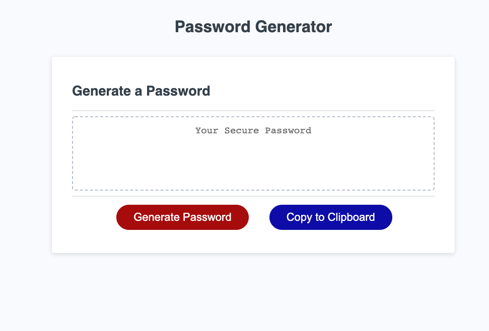
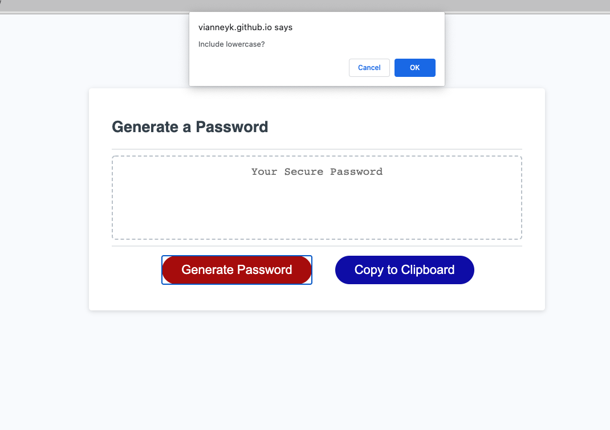
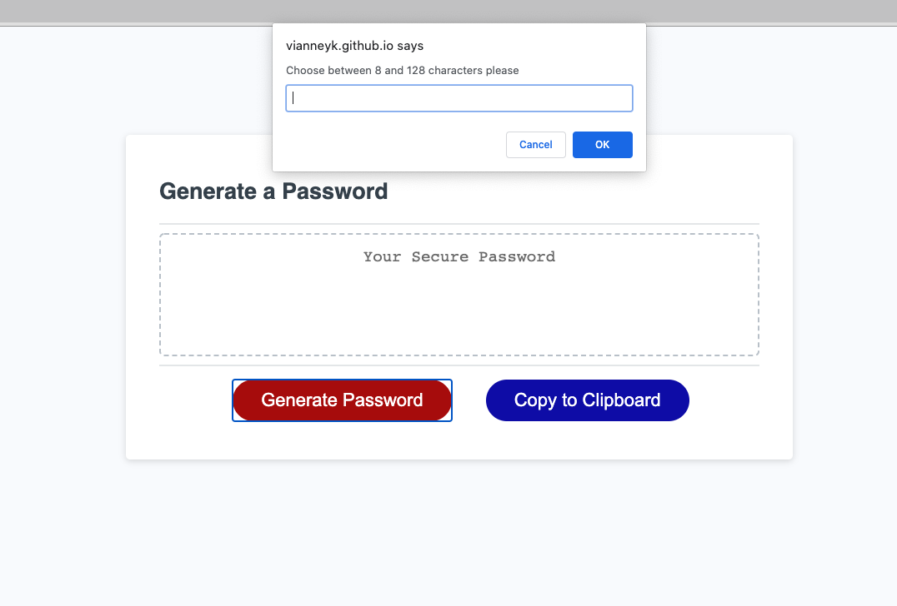

# Document for Password Generator

In this homework, with the combine use of HTML, CSS and Javascript, I created a password generator that generate random passwords. This depend on different criteria such as the length of the password, the inclusion of either an uppercase, a lowercase, a number or a special character.

When you press the "generate password" button, you are presented with different prompts in which you can choose how long your password would be (in this case between 8 and 128 characters) and which character to include.

Here is the link to the page 

https://vianneyk.github.io/Password-generator/

